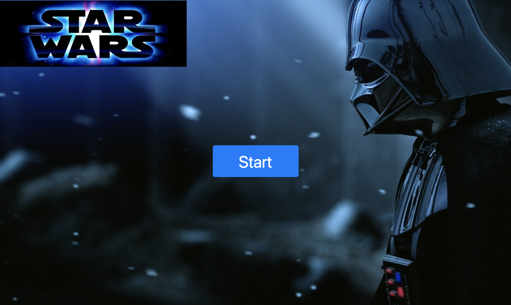

# TriviaGame

Star Wars Trivia Game created with Jquery and Javascript. There are 8 questions, answer the questions before the time runs out.

# Link to deployed site 
[Star Wars Trivia](https://mawais54013.github.io/TriviaGame/)

[Portfolio](https://mawais54013.github.io/New-Portfolio/)

# Images


# Technology Used 
- HTML
- CSS
- Javascript
- Bootstrap
- Jquery

# Code Snippets
1) Code Snippet shows how timer is set up with first clearing the interval and then the decrement function decrases number which is equal to 15 by every 1 second.
```
function run()
{ 
    clearInterval(interval);
    interval = setInterval(decrement, 1000);
}

function decrement()
{
    number--;
    $("#timer").html("Time remaining until next    question: " + number + " seconds");
    if((number === 0))
    {
        num1--;
        num2++;
        clearInterval(interval);
        nextQuestion();
    }
}
```
2) This code changes each question when the timer runs out and then resplaces the question and radio button with the next set. This keeps going until the questions are answered.
```
for(var i = 1; i < questions.length; i++)
        {    
            // labels change for each question with the code below along with the choices
            $("#question").html(questions[i-num1]); 
            $('label[for=inlineRadio1]').html(choices[num2][0]);
            $('label[for=inlineRadio2]').html(choices[num2][1]);
            $('label[for=inlineRadio3]').html(choices[num2][2]);
            $('label[for=inlineRadio4]').html(choices[num2][3]);
            console.log(num2);
        }
```

# Author 
[Muhammad Awais](https://github.com/mawais54013/Bootstrap-Portfolio)
